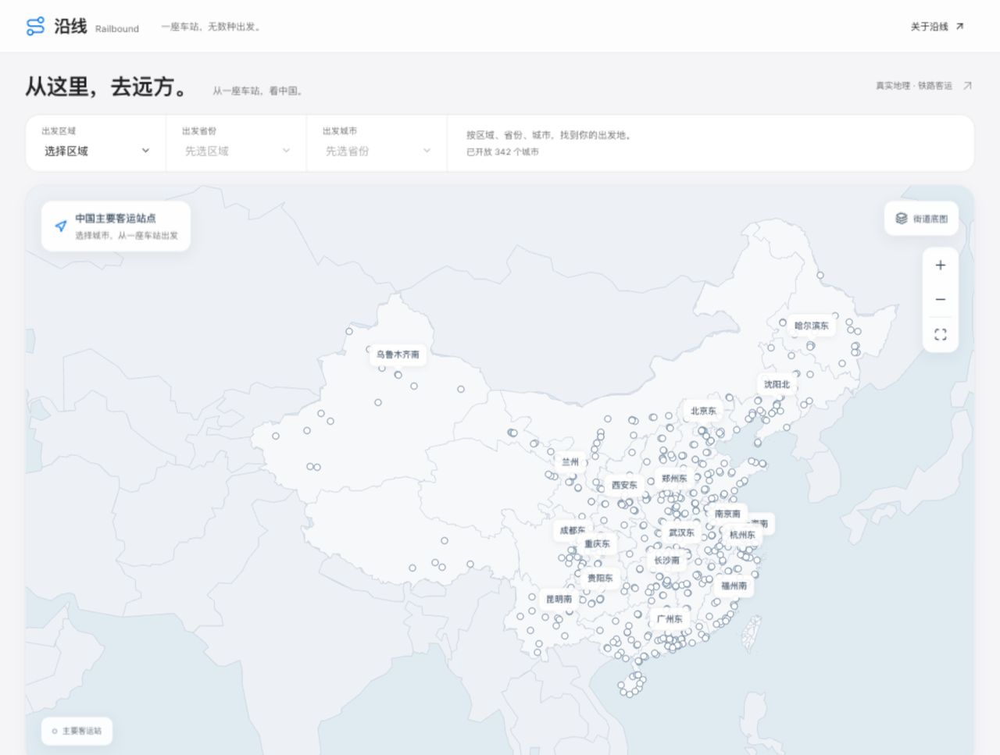
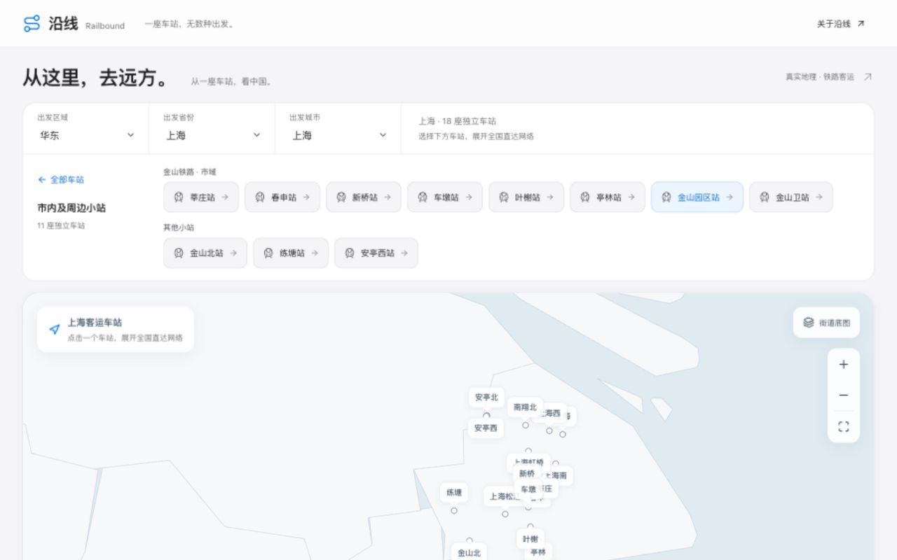

# 沿线 · Railbound

铁路客运直达网络的静态网站。React + TypeScript strict + Vite + Tailwind + Leaflet；可部署到 GitHub Pages，无后端、API key 或运行时列车查询。

从已开放城市的客运车站出发，探索有公开客运服务依据的直达车站与铁路走廊。

| 地图首页 | 上海小站目录 | 手机布局 |
| --- | --- | --- |
|  |  |  |

## 本地运行

需要 Node.js 24+、Python 3.10+。

```sh
npm ci
npm run dev
```

打开终端输出的本地地址即可预览。也可以运行 `npm run preview` 查看生产构建。

## 使用与开发

```sh
npm run data:build
npm test
npm run build
npm run preview
```

`npm run data:build` 从提交的清洗快照离线生成前端数据、GeoJSON 与审计报告，不需要下载全量轨道。重新获取轨道时，从下方 HOTOSM 来源下载并解压 GeoJSON，然后运行：

```sh
python3 scripts/preparePhysicalRails.py /absolute/path/railways.geojson --snapshot YYYY-MM-DD
npm run data:build
```

完整停站信息在 `data/raw/passenger-services.json`；每条记录保留来源 URL、日期与页面哈希。更新这些快照时必须重新核验中心站停站、公开客运属性和临客候选，不能仅更新日期。

## 已实现

打开首页先看主要客运车站地图。先按华北、东北、华东、华中、华南、西南、西北选择区域，再选省份和城市，才显示该城市独立车站的下一步选择；选择车站后展开客运网络、类型/地区/城市或站名搜索、同步统计、站点详情及直达目录。目录可定位地图，轨道可查看来源与客运服务例子。更改区域或省份时清空下一级；城市、车站旧分享链接自动补齐所属区域和省份，未选完的区域/省份也可刷新恢复。提供手机布局、键盘操作、减少动画、可分享的 URL 筛选、旅行笔记与数据说明。

首页先加载站点登记表，完整客运网络仅在选择车站或查看数据说明时按需加载。默认底图与数据全部本地读取；“街道底图”由用户主动启用后请求 OSM 公共瓦片服务。主要站点来自本次收录的站点登记表，并非全国所有车站。

## 线路画法

所有缩放级别都把相近的铁路轨道并为共用客运走廊；从中心站到可见站点只保留一套清晰的连接骨架，去掉平行替代线和回环。全国视图显示主要站点；放大后每个车站都有独立标记与点击入口，不合并不同车站。点选目的地时高亮共用走廊中的到达路径，表示“可以到”，不表示特定列车逐站经过这里。这个显示图不参与直达判定。长距离少停站区间沿已收录的铁路走廊绘制，不用两个停站直接拉长线。

## 扩展范围与数据边界

开放 342 城市、3,105 个独立出发站；接受 19,019 个服务，使用 3,193 个有来源坐标的车站。156,306 个已定位停站区间都有连续绘图路径，缺失 0。已接受服务中的国内停站坐标全部补齐；265 个目录入口仍待身份或正常客运记录核验，不开放空入口。

上一轮完成内蒙古12、辽宁14、吉林9、黑龙江13、海南12、西藏5个源目录城市/行政单位的采集，六份省级采集审计的 failedCities 均为空。此前逐站补核新增10个独立出发站、补齐6个国内目的站坐标，并完成三级出发地索引。目前入口覆盖大陆31个省级地区；目录覆盖不等于官方全部现行车次已穷尽。逐市清单见 [扩展进度](docs/EXPANSION-PROGRESS.md)，后续步骤见 [接班说明](HANDOFF.md)。加格达奇等5站按有来源的行政管理归属分类，保留原坐标和地理省界事实；古城、盘古与褚家湾的错误目录条目分别纠正。四方台坐标身份已核验，但仍无已接受的正常客运记录，不开放入口。

庆盛与南沙北、新塘与广州新塘是官方更名的同一车站，已统一曾用名检索；新塘南及其他不同车站均保留独立 ID，不合并站点。 更名证据见 [广州交通部门公告](https://jtj.gz.gov.cn/xwdt/gzdt/content/post_10483759.html)。

中老跨境车次保留完整停站事实；本轮地图收录中国境内部分，已确认的老挝站与国内待定位站分开审计，不能把同名海外站连到国内站。

页面不完整的时刻源单独保存哈希与排除原因；未取得完整停站表的候选不能制造直达关系。第三方快照不保证当天开行。

## 逐城市继续扩展

`data/raw/jiangsu-station-index.json` 保留江苏底稿；新增城市使用 `city-*-station-index.json` 和 `city-*-services.json`，并保存 URL、源日期及页面哈希。完整服务事实在城市间复用，出发站登记自动生成城市与站点入口。坐标只接受已核验的独立车站，不能用城市中心代替。

```sh
python3 scripts/expandProvinces.py neimenggu:内蒙古
npm run data:build
npm test
npm run build
```

后续优先逐市复核待开放小站、同名身份与特殊行政管理归属，遵循 HANDOFF.md 的核验与续传步骤。若有未定位站点，先用 `resolveStationCoordinates.py` 补坐标；`verifyCoordinateCandidates.py` 仅把英文坐标表当候选区域，再通过原始 OSM 对象上的中文站名验证；`acquireWikidataCoordinates.py` 配合明确的同名消歧义登记补充高精度铁路车站坐标。`acquireSnapshotStationObjects.py` 从 HOTOSM 找到候选节点 ID 后读取 OSM 原始对象，核对中文名、可见性和铁路属性；不能直接把裁剪快照中的所有同名点当成客运站。采集与坐标步骤需要联网，已提交快照的构建完全离线。

## 来源与许可

[Wikidata](https://www.wikidata.org/) 的结构化车站坐标使用 CC0；拒绝海外同名对象、消歧义页和粗略坐标。每个站点保留实际来源链接。

[铁路网江苏车站目录](https://www.crecc.com/jiangsu/)、[铁路网徐州站](https://www.crecc.com/jiangsu/xuzhou/xuzhou.html)、[徐州东站](https://www.crecc.com/jiangsu/xuzhou/xuzhoudong.html)：第三方公开时刻与完整停站页面，保存事实摘要，不复制页面全文。

[HOTOSM 中国铁路 / HDX](https://data.humdata.org/dataset/hotosm_chn_railways)：OSM/Geofabrik 轨道及站点快照，© OpenStreetMap contributors，[ODbL 1.0](https://opendatacommons.org/licenses/odbl/1-0/)。`physical-rails.json`、轨道 GeoJSON 及关联衍生数据库按 ODbL 提供，来源引用通过 `physicalSources` 共享登记表完整保留，避免每个区段重复存储长列表。该登记表引用覆盖来源走廊，不代表每个 OSM way 都是当前区段的精确范围。

[railroutes 中国包](https://github.com/mayurrawte/railroutes/tree/main/packages/china)、[车站坐标补充](https://github.com/listenzcc/China-rail-way-stations-data)：辅助坐标；每站 `coordinateSource` 可追溯，中文 OSM 精确匹配优先。部分城市字段待核验，不用猜测填充。

[Natural Earth](https://www.naturalearthdata.com/)：公共领域行政区底图。软件代码许可见 `LICENSE`，第三方数据不适用软件许可。

## GitHub Pages

1. 将项目目录内容（包含 `.github`）推送到仓库的 `main` 分支。
2. 在仓库 Settings → Pages → Source 选择 **GitHub Actions**。
3. 推送 `main`，或手动运行 Deploy to GitHub Pages 工作流。
4. 部署成功后，在仓库 Pages 页面打开实际生成的网站链接。

构建使用相对资源路径 `base: './'`，支持仓库子目录和自定义域名。页面状态使用查询参数，无额外路由重写要求。工作流自动重新生成数据、运行单元测试、构建并部署 `dist`。

## 验证

`npm test` 验证去重、客运过滤、来源引用、同服务直达、全部已开放出发站及筛选一致性。`npm run test:e2e` 提供桌面/手机 Playwright 测试（首次需 `npx playwright install chromium`）。本次另用真实浏览器检查首页选择阶段、地图线形、搜索、详情、移动端和控制台；记录见 `VERIFICATION.md`。

## 文件

`src/components` 页面控件；`src/map` 地图；`src/travel` 笔记；`src/lib/network.ts` 可达关系与筛选；`scripts` 离线 ETL；`data/raw` 清洗快照；`data/railway-segments.geojson` 物理轨道；`data/audit.json` 审计；`.github/workflows/deploy.yml` 发布。

已完成城际二级选站：36城、27条线路/运营分段、225个独立站点（本轮新增78个导航归类）。深圳北与“城际铁路”并列，点击城际后再选择深圳机场等站。保留主要枢纽快捷入口，不合并站点；归类依据与后续范围见 [城际归类清单](docs/INTERCITY-CLASSIFICATION.md)。广州长隆旧源误列珠海，上一轮已纠正为广州，原站点ID和坐标保留。

本轮主题采用苹果式的冷白界面、系统字体、蓝色选中态和轻盈地图浮层。地图保持首页主画面，长城际列表独立滚动。方案与复核见 [视觉方案](docs/DESIGN.md)。共有枢纽从普通入口返回普通列表；从城际入口出发则用显式group参数保留返回组。跨省线路按每站真实所属城市归类。

新增“市内及周边小站”入口：303城、2,225个独立站点，和城际入口分开。上海莘庄等金山铁路小站归在市域子目录，不当作城际；主要站保留外层。归纳依据和导航规则见 [小站归类](docs/SMALL-STATION-CLASSIFICATION.md)。
